<div align="center">

# ⚡ Design and Analysis of a 5.9V AC-to-DC Regulated Power Supply

### Full-Wave Bridge Rectifier • Capacitor Filter • Zener Voltage Regulator • LTspice Simulation


<br>


*A complete AC-to-DC regulated power supply designed using a bridge rectifier, capacitor filter, and Zener diode voltage regulator. The project demonstrates the conversion of a 12V AC source into a stable 5.9V DC output through theoretical analysis and LTspice simulation.*

</div>

---

# 📖 Project Overview

Power supply circuits are fundamental building blocks of electronic systems, providing the stable DC voltage required for reliable operation of electronic devices. Since utility power is supplied as alternating current (AC), an efficient conversion process is required to produce a regulated direct current (DC) output.

This project presents the **design, simulation, and performance analysis of a 5.9V AC-to-DC regulated power supply**. The system consists of three essential stages:

- **Full-Wave Bridge Rectification**
- **Capacitor Filtering**
- **Zener Diode Voltage Regulation**

Initially, the AC input is converted into pulsating DC using a full-wave bridge rectifier. A capacitor filter then smooths the rectified waveform by reducing ripple voltage, producing a nearly constant DC level. Finally, a Zener diode operating in its reverse breakdown region regulates the voltage, ensuring a stable output of approximately **5.9V** across a **1 kΩ load resistor**.

The complete circuit was designed and simulated using **LTspice**, while all design parameters—including ripple voltage, capacitor sizing, series resistor selection, line regulation, and load regulation—were verified through theoretical calculations and simulation results. The final design demonstrates an efficient, economical, and reliable low-power DC power supply suitable for educational and laboratory applications.

---

# 🎯 Project Objectives

The objectives of this project are to:

- Design a regulated AC-to-DC power supply.
- Convert AC voltage into pulsating DC using a bridge rectifier.
- Reduce ripple voltage using a smoothing capacitor.
- Design an effective Zener diode voltage regulator.
- Calculate capacitor and resistor values using engineering design equations.
- Analyze ripple voltage theoretically and practically.
- Study line and load regulation characteristics.
- Validate theoretical calculations through LTspice simulation.
- Obtain a stable **5.9V regulated DC output**.

---

# 🛠 Software & Components

## Software Used

| Software | Purpose |
|-----------|----------|
| LTspice | Circuit Design & Simulation |
| LaTeX | Technical Documentation |

---

## Components Used

| Component | Specification |
|------------|---------------|
| Step-Down Transformer | 12V RMS |
| Bridge Rectifier | Full-Wave Configuration |
| Capacitor Filter | 220 µF |
| Zener Diode | 5.2V |
| Silicon Diode | 0.7V |
| Series Resistor | 820 Ω |
| Load Resistor | 1 kΩ |

---

# ⚙️ Design Specifications

| Parameter | Value |
|------------|-------|
| Input Voltage | 12V AC (RMS) |
| Output Voltage | 5.9V DC |
| Load Resistance | 1 kΩ |
| Bridge Rectifier Voltage Drop | 1.4V |
| Zener Voltage | 5.2V |
| Silicon Diode Drop | 0.7V |
| Mains Frequency | 50 Hz |
| Ripple Frequency | 100 Hz |
| Capacitor | 220 µF |
| Series Resistor | 820 Ω |

---

# 🔄 System Flowchart

The complete operation of the regulated power supply is illustrated below.

<p align="center">
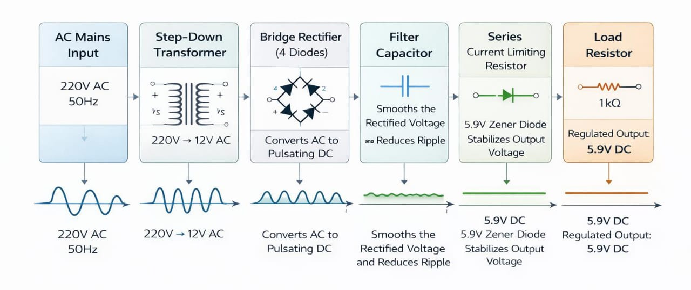
</p>

### Process Flow

```text
12V AC Input
      │
      ▼
Step-Down Transformer
      │
      ▼
Bridge Rectifier
      │
      ▼
Capacitor Filter
      │
      ▼
Zener Voltage Regulator
      │
      ▼
Regulated 5.9V DC Output
```

---

# 🔌 Complete Circuit Schematic

The complete circuit was designed and simulated in **LTspice**. It consists of a bridge rectifier, smoothing capacitor, current-limiting resistor, Zener diode regulator, and resistive load.

<p align="center">
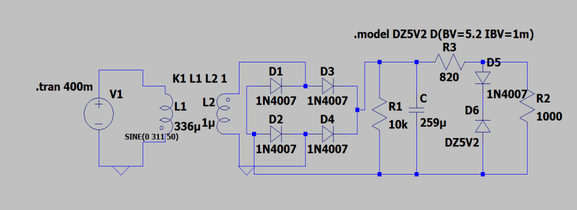
</p>

The bridge rectifier converts alternating current into pulsating direct current, while the capacitor and Zener regulator work together to produce a stable, low-ripple DC output suitable for powering electronic circuits.

---
# 🔧 Hardware Implementation

The designed power supply was successfully implemented using discrete electronic components. The hardware prototype follows the same design as the LTspice simulation and demonstrates the practical realization of the regulated power supply.

The circuit consists of a bridge rectifier, smoothing capacitor, series resistor, Zener diode voltage regulator, and load resistor. The hardware implementation validates the theoretical calculations and simulation results by producing a stable regulated DC output.

<p align="center">
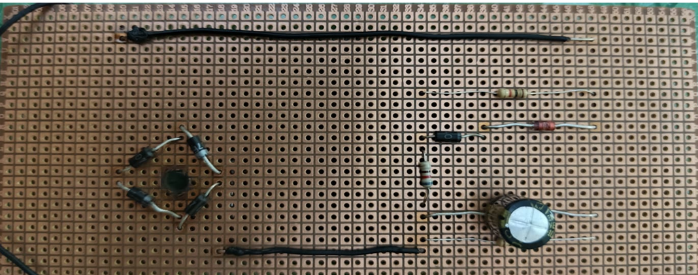
</p>

### Hardware Components

| Component | Specification |
|-----------|---------------|
| Transformer | 12V AC |
| Bridge Rectifier | 4 × Silicon Diodes |
| Filter Capacitor | 220 µF |
| Series Resistor | 820 Ω |
| Zener Diode | 5.2 V |
| Load Resistor | 1 kΩ |

# 🌊 Input AC Waveform

The first stage of the circuit begins with a sinusoidal AC waveform supplied from the transformer secondary.

<p align="center">
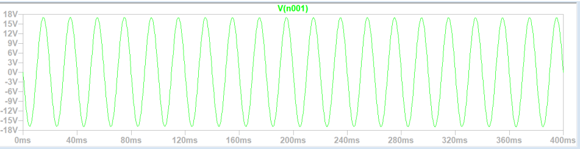
</p>

### Input Characteristics

| Parameter | Value |
|-----------|-------|
| Waveform | Sinusoidal AC |
| RMS Voltage | 12V |
| Frequency | 50 Hz |

The AC waveform serves as the primary energy source for the power supply and undergoes rectification, filtering, and voltage regulation before reaching the load.

---

# 🌉 Full-Wave Bridge Rectification

The bridge rectifier utilizes four diodes to convert both the positive and negative half cycles of the AC input into pulsating DC. Unlike a half-wave rectifier, this configuration makes use of the entire input waveform, improving efficiency and doubling the ripple frequency to **100 Hz**.

<p align="center">
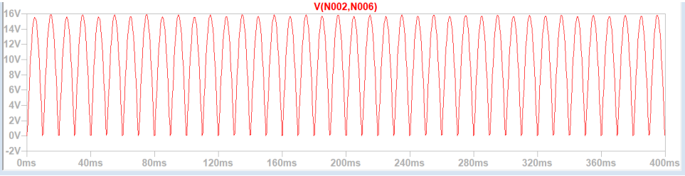
</p>

### Peak Voltage Calculation

```text
Peak Voltage

Vpeak = Vrms × √2

Vpeak = 12 × 1.414

Vpeak ≈ 16.97 V
```

Considering the voltage drop across two conducting diodes:

```text
Rectified Peak Voltage

Vrectified = 16.97 − 1.4

Vrectified ≈ 15.6 V
```

This rectified waveform provides the input for the capacitor filtering stage, where ripple voltage is significantly reduced before voltage regulation.# ⚙️ Positive and Negative Half-Cycle Operation

A full-wave bridge rectifier operates by utilizing both halves of the AC input waveform. During each half cycle, a pair of diodes becomes forward biased while the remaining pair remains reverse biased. As a result, current always flows through the load in the same direction, producing a full-wave rectified output.

This method significantly improves efficiency compared to half-wave rectification and doubles the ripple frequency from **50 Hz** to **100 Hz**, making filtering easier.

<p align="center">
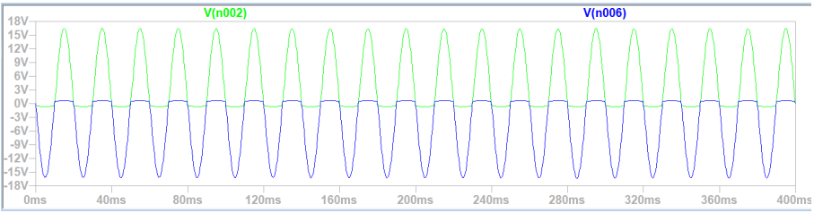
</p>

### Advantages

- Utilizes both half cycles of the AC input.
- Higher average DC output.
- Improved transformer utilization.
- Reduced ripple compared to half-wave rectification.
- Higher conversion efficiency.

---

# 🔋 Capacitor Filter

Although the bridge rectifier converts AC into DC, the output still contains ripple components. A capacitor connected across the load acts as a smoothing filter by charging near the peak voltage and discharging slowly when the input voltage decreases.

This charging and discharging process greatly reduces ripple voltage and produces a much smoother DC waveform before voltage regulation.

<p align="center">
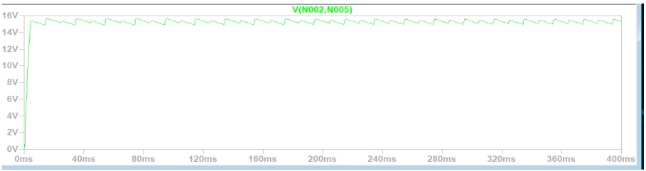
</p>

### Working Principle

- Capacitor charges during voltage peaks.
- Capacitor discharges slowly through the load.
- Ripple voltage decreases significantly.
- Output becomes smoother before regulation.

---

# 📊 Ripple Voltage Analysis

Ripple voltage is one of the most important performance parameters of a DC power supply. It represents the small AC component that remains superimposed on the DC output after rectification.

For a full-wave rectifier,

```text
Vr = IL / (f × C)
```

Using the design values:

| Parameter | Value |
|-----------|--------|
| Load Current | 5.9 mA |
| Ripple Frequency | 100 Hz |
| Capacitor | 220 µF |

Theoretical Ripple Voltage

```text
Vr = IL / (f × C)

Vr = 0.0059 / (100 × 220 × 10⁻⁶)

Vr ≈ 0.268 V
```

The ripple voltage obtained satisfies the design requirement for a low-power regulated supply.

---

# 🧮 Capacitor Selection

The required capacitor value was determined using the allowable ripple voltage.

### Assumed Ripple

```text
Vr = 5% × Vout

Vr = 0.05 × 5.9

Vr = 0.295 V
```

Capacitance calculation:

```text
C = IL / (f × Vr)

C = 0.0059 / (100 × 0.295)

C ≈ 200 µF
```

The nearest commercially available capacitor value was selected.

## Selected Capacitor

```text
220 µF
```

The selected capacitor provides additional ripple reduction while maintaining stable operation.

---

# 📈 Ripple Reduction

The effectiveness of the capacitor filter can be observed from the filtered output waveform.

<p align="center">

</p>

### Comparison

| Without Capacitor | With Capacitor |
|-------------------|----------------|
| Large Ripple | Small Ripple |
| Pulsating DC | Smooth DC |
| Poor Regulation | Improved Regulation |

The capacitor reduces voltage fluctuations and improves overall power supply performance.

---

# 📊 Maximum Output Voltage

The maximum voltage across the load was measured after rectification and filtering.

<p align="center">
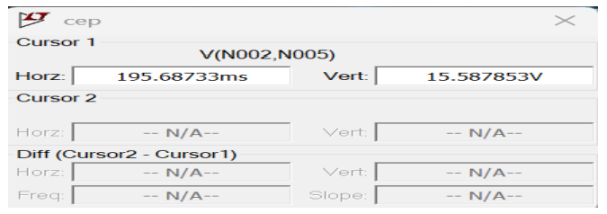
</p>

The measured peak voltage closely matches the theoretical calculations, confirming correct operation of the bridge rectifier and filter network.

---

# 📉 Minimum Output Voltage

The minimum voltage occurs between successive charging intervals of the capacitor.

<p align="center">
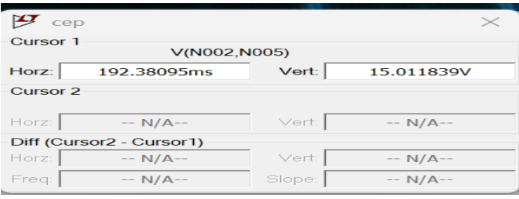
</p>

The voltage drop remains within the expected ripple limits, demonstrating effective smoothing by the capacitor filter.

---

# 📐 Series Resistor Design

The series resistor limits current through the Zener diode and ensures stable voltage regulation.

The resistor value is determined using

```text
Rs = (Vin - Vout) / (IL + IZ)
```

Using the design parameters,

```text
Input Peak Voltage = 15.6 V

Output Voltage = 5.9 V

Load Current = 5.9 mA

Chosen Zener Current = 5 mA
```

Calculation:

```text
Rs

= 9.7 / (0.0059 + 0.005)

≈ 890.8 Ω
```

The nearest standard resistor value selected is

```text
820 Ω
```

The resulting series current is approximately

```text
11.83 mA
```

while the calculated Zener current is approximately

```text
5.93 mA
```

These values ensure reliable voltage regulation while protecting the Zener diode from excessive current.


---

# 💡 Zener Diode Voltage Regulation

The final stage of the power supply uses a Zener diode operating in reverse breakdown to maintain a constant output voltage despite input or load variations.


Using

```text
Vout = Vz + Vd
```

where

- Zener Voltage = **5.2 V**
- Silicon Diode Drop = **0.7 V**

Final Output

```text
Vout

= 5.2 + 0.7

= 5.9 V
```

The regulator effectively maintains a constant DC voltage while minimizing the effect of ripple and supply fluctuations.

---

# ⚡ Final Regulated Output

The final output waveform demonstrates successful rectification, filtering, and regulation.

<p align="center">
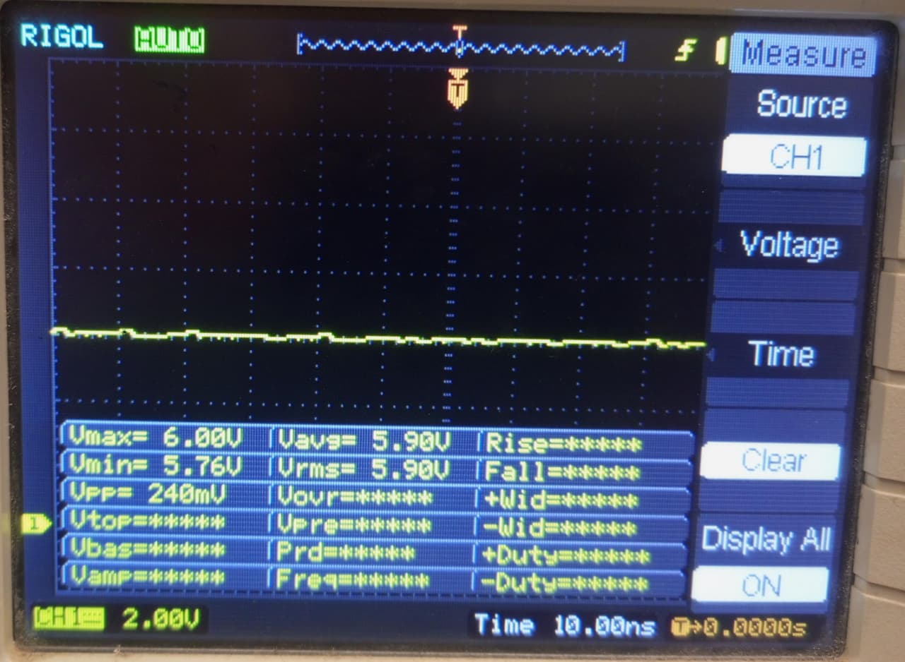
</p>

### Final Performance

| Parameter | Value |
|-----------|--------|
| Output Voltage | **5.9 V** |
| Load Resistance | **1 kΩ** |
| Load Current | **5.9 mA** |
| Ripple Voltage | **≈0.240 V (Practical)** |

The resulting output is a stable, low-ripple DC voltage suitable for powering low-power electronic devices and validating the effectiveness of the complete AC-to-DC power supply design.# 📈 Ripple Voltage Analysis

The quality of a regulated power supply is greatly influenced by its ripple voltage. Ripple represents the residual AC component superimposed on the DC output after rectification and filtering. Lower ripple voltage indicates a smoother and more stable DC output.

For the designed circuit, both theoretical calculations and LTspice simulations were performed to evaluate ripple performance.

### Theoretical Ripple Voltage

| Parameter | Value |
|-----------|--------|
| Output Voltage | 5.9 V |
| Load Current | 5.9 mA |
| Capacitor | 220 µF |
| Ripple Frequency | 100 Hz |

Calculated ripple voltage:

```text
Vr = 0.268 V
```

Ripple Percentage:

```text
Ripple = (0.268 / 5.9) × 100

≈ 4.54%
```

### Practical Ripple Voltage

The ripple voltage measured from the simulation was

```text
Vr = 0.240 V
```

Ripple Percentage

```text
Ripple = (0.240 / 5.9) × 100

≈ 4.07%
```

The small difference between theoretical and practical values is mainly due to the non-ideal behavior of electronic components and simulation conditions.

<p align="center">

</p>

---

# 📉 Line Regulation

Line regulation measures the ability of the power supply to maintain a constant output voltage when the input voltage changes.

The line regulation for the designed Zener regulator is calculated using

```text
ΔVout = ΔVin × rz / (Rs + rz)
```

### Design Parameters

| Parameter | Value |
|-----------|--------|
| Series Resistor | 820 Ω |
| Zener Resistance | 30 Ω |
| Input Variation | ±1 V |

### Calculated Result

```text
Line Regulation

≈ 35.3 mV/V
```

This indicates that even with variations in input voltage, the regulated output remains highly stable.


---

# 📊 Load Regulation

Load regulation indicates how well the output voltage remains constant as the load current changes.

Using

```text
Load Regulation = IL × rz
```

Calculated value

```text
Load Regulation

≈ 177 mV
```

Percentage Load Regulation

```text
≈ 3%
```

This result confirms that the designed regulator maintains excellent voltage stability under varying load conditions.

---

# 💻 LTspice Simulation Results

The complete AC-to-DC regulated power supply was designed and verified using **LTspice**.

The simulation validates every stage of the power supply, including:

- AC Input
- Full-Wave Bridge Rectification
- Capacitor Filtering
- Ripple Reduction
- Zener Voltage Regulation
- Final 5.9V Output

<p align="center">
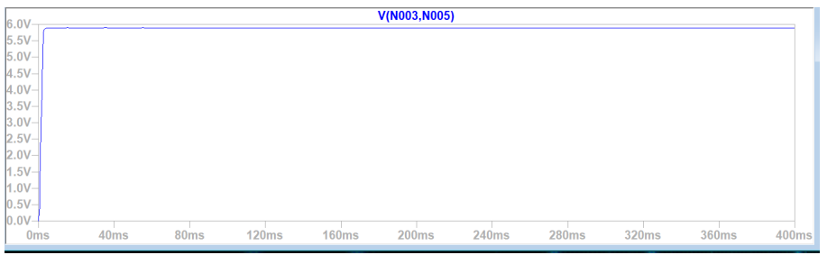
</p>

### Simulation Summary

| Parameter | Result |
|-----------|--------|
| AC Input | 12 V RMS |
| Peak Rectified Voltage | 15.6 V |
| Filter Capacitor | 220 µF |
| Series Resistor | 820 Ω |
| Regulated Output | 5.9 V |
| Practical Ripple | 0.240 V |

The simulation results closely match the theoretical calculations, confirming the correctness of the design.

---

# 📋 Key Results

| Parameter | Value |
|-----------|--------|
| Input Voltage | 12 V AC |
| Peak Voltage | 16.97 V |
| Rectified Peak Voltage | 15.6 V |
| Output Voltage | **5.9 V** |
| Load Resistance | 1 kΩ |
| Load Current | 5.9 mA |
| Capacitor | 220 µF |
| Series Resistor | 820 Ω |
| Ripple Voltage | 0.240 V |
| Ripple Percentage | 4.07% |
| Line Regulation | 35.3 mV/V |
| Load Regulation | 177 mV |

---

# 🚀 Applications

The designed regulated power supply can be used in various low-power electronic applications, including:

- Embedded System Projects
- Arduino Development Boards
- Microcontroller Circuits
- Digital Electronics Laboratories
- Sensor Interfaces
- Communication Circuits
- Educational Demonstrations
- Electronic Prototyping

---

# 📈 Future Improvements

The performance of the power supply can be further enhanced by implementing:

- Integrated Voltage Regulators (7805 / LM317)
- Switching Mode Power Supply (SMPS)
- Higher Current Capability
- Thermal Protection
- Over-Current Protection
- Reverse Polarity Protection
- PCB Design and Fabrication
- Digital Voltage Monitoring
- Efficiency Optimization

---

# 🎓 Learning Outcomes

Through this project, the following engineering concepts were successfully explored:

- AC to DC Power Conversion
- Full-Wave Bridge Rectification
- Capacitor Filtering
- Ripple Voltage Analysis
- Voltage Regulation using Zener Diodes
- Series Resistor Design
- Line and Load Regulation
- LTspice Circuit Simulation
- Electronic Circuit Analysis
- Practical Power Supply Design

---

# 📜 Conclusion

This project successfully demonstrates the complete design and analysis of a **5.9V AC-to-DC regulated power supply** using a bridge rectifier, capacitor filter, and Zener diode voltage regulator. The designed circuit efficiently converts a **12V AC** input into a stable **5.9V DC** output suitable for powering low-power electronic circuits.

Theoretical calculations, component selection, and LTspice simulations showed strong agreement, validating the effectiveness of the design. The capacitor filter significantly reduced ripple voltage, while the Zener regulator maintained a constant output voltage despite input and load variations.

Overall, this project provides a practical understanding of rectification, filtering, ripple reduction, and voltage regulation. It serves as an excellent foundation for studying analog electronics and regulated power supply design in real-world engineering applications.

---

# 👨‍💻 Author

**Muhammad Sufyan**

Electrical Engineering Student

**Pakistan Institute of Engineering and Applied Sciences (PIEAS)**

### Skills Demonstrated

- Analog Electronics
- Power Supply Design
- Electronic Circuit Analysis
- LTspice Simulation
- Bridge Rectifier Design
- Voltage Regulation
- Ripple Analysis
- Technical Documentation

---

# 📄 License

This project is published for **educational and academic purposes**. It may be used for learning, research, and reference with appropriate acknowledgment.

---

<div align="center">

### ⭐ If you found this project useful, consider giving it a star!

**Thank you for visiting this repository.**

</div>
